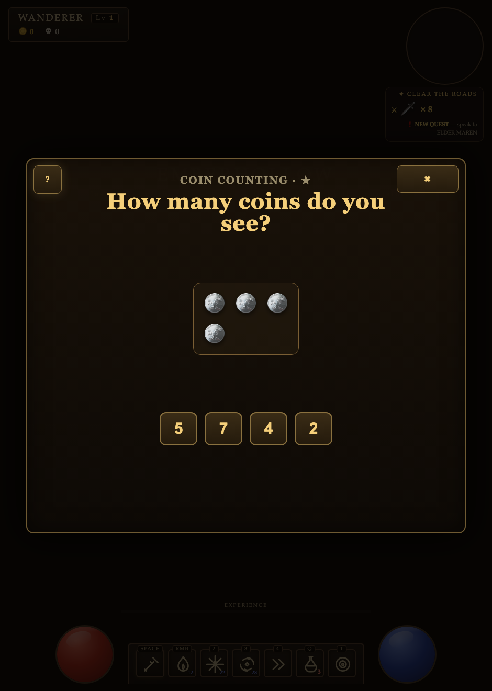
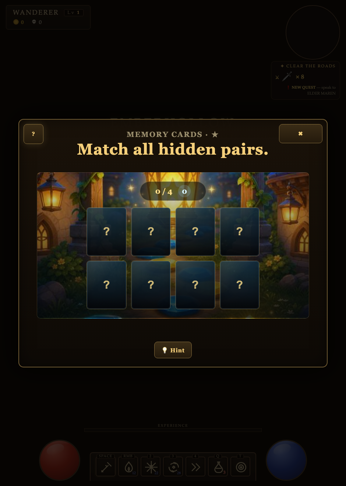
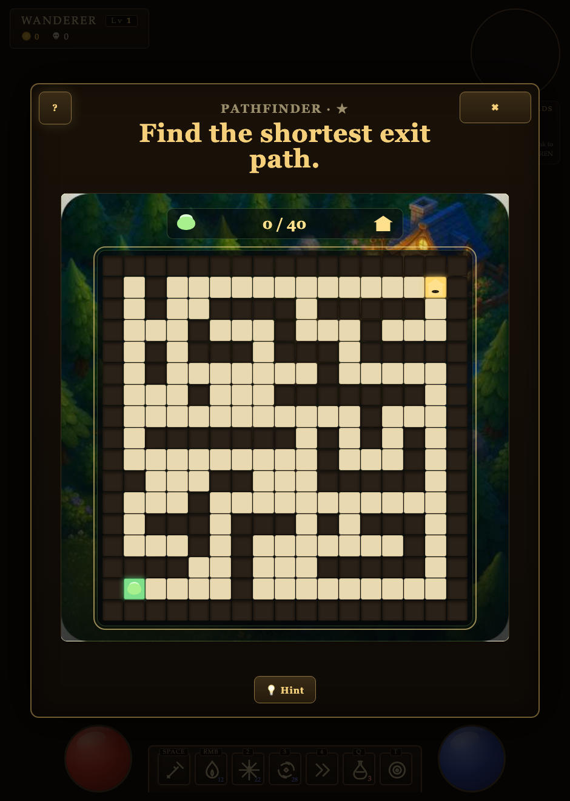
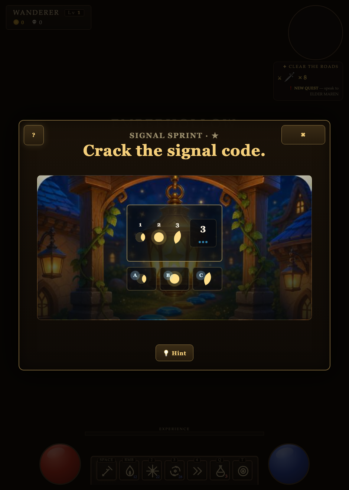
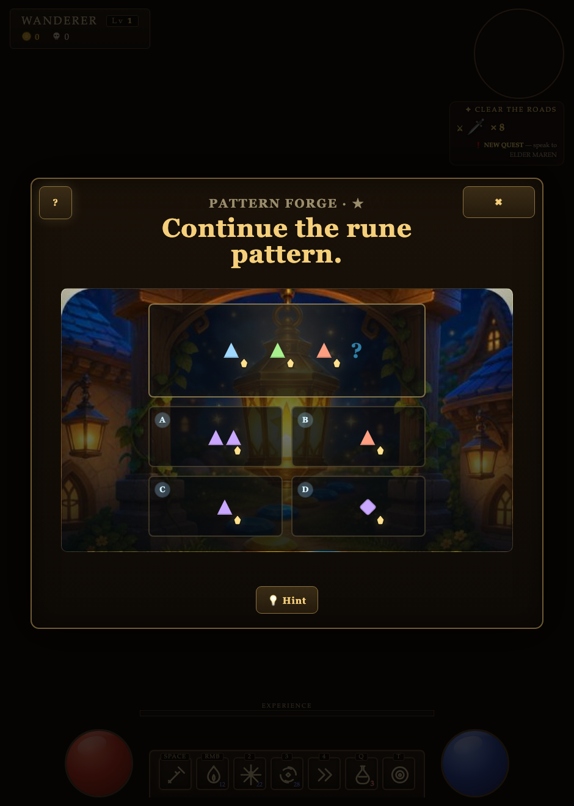
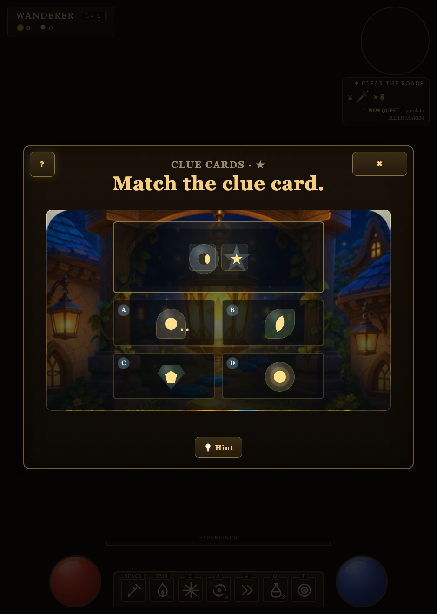
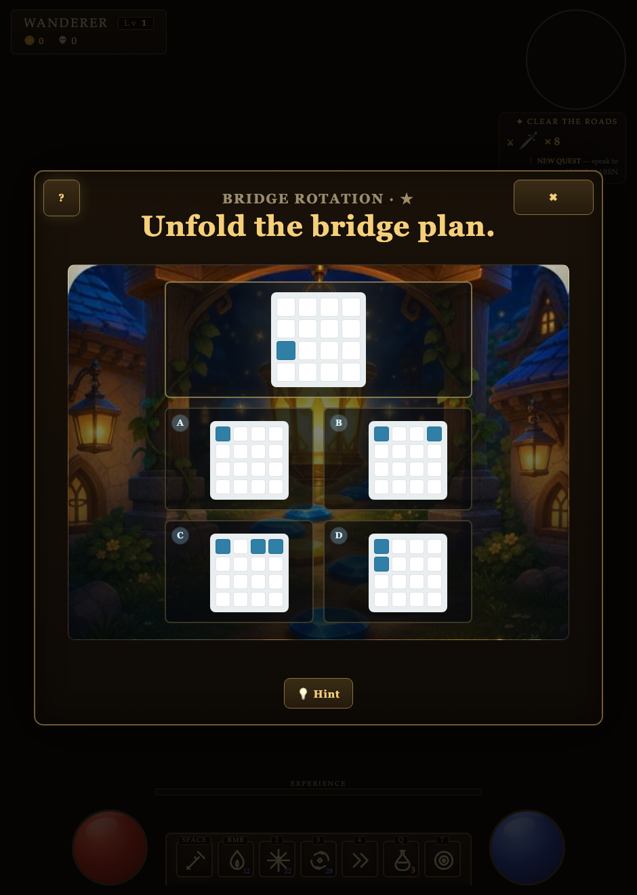
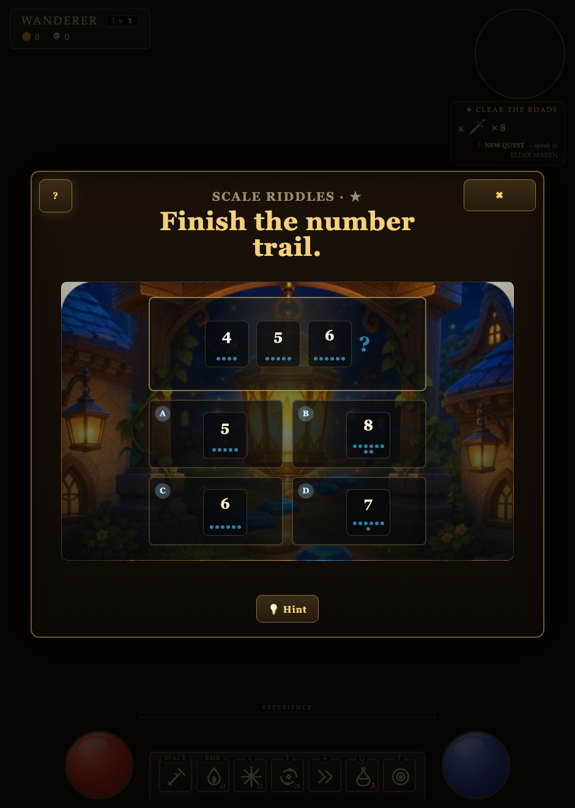
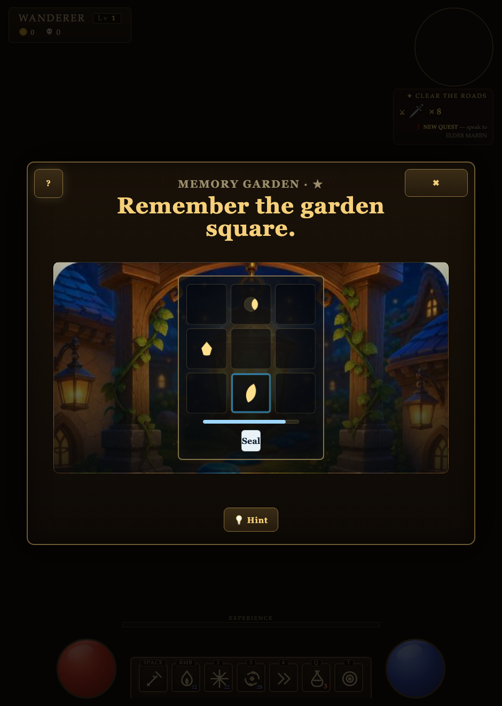

# Sanctum of Ash — Brannic's Learning Mini-Games

Documentation of all the puzzle/logic/math mini-games. These are launched from **Brannic the Innkeeper** (the `innmaster` vendor) inside the tavern, and are intended as logic / math / IQ-style puzzles for a **~7-year-old (early/non-reader)**.

> Live screenshots of every game are saved in [`screenshots/`](screenshots/) (one PNG per game id, e.g. `screenshots/count_coins.png`). They are embedded inline below and described in words. Hand the `screenshots/` folder to the AI alongside this document.

## Architecture (how the games are built)

All mini-game code lives in one `<script id="minigames">` block (lines ~8806–12050 of `sanctum-of-ash.html`).

- **`LearningSubsystem`** (≈11685–12048) — the host. Builds a `.learning-overlay` modal, runs the round loop, handles answer submission (`isIqSelectionCorrect`), hints, "Next", "Try Again", and an optional example/demo.
- **`defineLearningGame(config)`** (≈8887) — wraps a **fully custom** game (its own generate / render / check logic). Used by: **Coin Counting, Pathfinder, Memory Cards**.
- **`createIqItem({familyId, seed, difficulty})`** (≈10302) — the shared **IQ-item generator** dispatcher. ~18 puzzle "families" (matrix, analogy, classification, series, balance, quantity, number-series, number-analogy, rotation, folding, assembly, maze, picture-memory, memory-matching, symbol-search, symbol-coding, cancellation-search, pictorial).
- **`createIqFamilyGame(config)`** (≈10849) — wraps a *set* of IQ families into one game, picking a random family each round. Used by: **Signal Sprint, Pattern Forge, Clue Cards, Bridge Rotation, Scale Riddles, Memory Garden**.

The inn's menu is `MG_LIST` (≈line 16584). It lists **8** games. There is a **9th** registered game (`Memory Garden`) that is *not* in `MG_LIST`, so a player can never reach it.

---

## The 8 player-facing games

### 1. Coin Counting — `count_coins` (custom)  ✅ clean

- **What it does:** Shows coins in one or two groups; the child picks the total from four number buttons.
- **How it works:** Tier 0 = one group of 2–5 coins ("How many coins do you see?"). Tier 1+ = two groups shown with a "+" separator ("Count ALL the coins together"). 4 shuffled number buttons; click the one equal to `a + b`. 3 rounds/session.
- **Correct answer:** `total = a + b`. Distractors are `total ± (1..3)`, deduped, padded to 4, shuffled.
- **On screen:** "How many coins do you see?" with 5 silver coins and buttons `5 / 4 / 7 / 2`.
- **Notes:** Title, label, and mechanics all agree. No bugs found.

### 2. Memory Cards — `memory_cards` (custom)  ✅ clean

- **What it does:** Classic flip-to-match: find all pairs of identical symbols.
- **How it works:** 4/6/8 pairs by tier from 8 symbols (sun/moon/star/leaf/drop/bolt/key/gem). Flip two cards; matches stay up, mismatches flash red (680 ms) and flip back. Win when all pairs matched; unlimited attempts. Hint highlights one unmatched pair.
- **Correct answer:** completion-based — `matched.size === cards.length`.
- **On screen:** 8 face-down "?" cards (4 pairs), `0/4` matched + a moves badge, illustrated background, Hint button.
- **Notes:** No bugs found.

### 3. Pathfinder — `path_maze` (custom)  ⚠️ several issues

- **What it does:** Navigate a maze from start (bottom-left) to exit (top-right) with arrow keys / WASD within a step budget.
- **How it works:** DFS-carved maze with extra walls removed to add loops; BFS computes the shortest path. Win = reach the goal within `maxMoves = bestMoves + max(4, ceil(size*0.45))`. Hint reveals the next 3 cells of the stored path. Tier sizes **17×17 / 25×25 / 33×33**; ~90 s budget.
- **Correct answer:** reach goal under the move cap (NOT actually the shortest path).
- **On screen:** a large ~14–17-wide maze, green slime at bottom-left, house exit top-right, a `0/40` counter; the panel can overflow the viewport.
- **Notes:** prompt says "Find the **shortest** exit path" but any path within budget wins; the counter reads `moves / bestMoves` (looks like a loss); the maze is very large for the age; the hint can point backward if the child takes an alternate shortest path. (See fix doc.)

### 4. Signal Sprint — `gem_line` (IQ family)  ⚠️ high-impact issues

- **Inn label:** "spot the matching gems" — **but there are no gems.**
- **What it does:** One of three sub-puzzles per round: **symbol-search** (find all exact-matching shapes in a grid), **symbol-coding** (decode a number→symbol key), or **cancellation-search** (mark all of a target symbol).
- **How it works:** `createIqFamilyGame` over `['symbol_search','symbol_coding','cancellation_search']`. Search/cancellation are multi-select (click cells, then "Seal" to submit); coding is single-select. `isIqSelectionCorrect` compares the sorted selected IDs to the correct IDs (no partial credit).
- **On screen:** "Crack the signal code" with positions 1/2/3 of light-shapes, a boxed "3" with dots, and A/B/C options.
- **Notes:** label≠content; hollow-fill shapes look like moon phases to a child; coding needs number literacy; search/cancellation symbols are perceptually confusable; multi-select gives no per-click feedback. (See fix doc.)

### 5. Pattern Forge — `rune_matrix` (IQ family)  ⚠️ high-impact issues

- **Inn label:** "find the missing rune."
- **What it does:** Random per round across **visual_matrix** (grid completion), **visual_analogy**, **visual_classification** (odd-one-in), and **pattern_series** (continue a sequence). Pick the missing/continuing tile from 4–5 options.
- **How it works:** items are built from visual features `shape|color|count|fill|rotation|sign`; a rule is applied; the answer is checked by `itemKey` equality. Distractors are one-feature mutations + explicit wrong transforms.
- **On screen:** blue triangle, green triangle, red triangle, then "?", options A–D (single/double triangles + a diamond).
- **Notes:** the color order (gold→blue→green→red→violet) is arbitrary (not the rainbow); some distractors satisfy a *second* valid rule (ambiguous); 4 different puzzle types under one constant title; tier-0 series shows only 2 example steps. (See fix doc.)

### 6. Clue Cards — `clue_cards` (IQ family)  ⚠️ high-impact issues

- **Inn label:** "picture puzzles."
- **What it does:** Show 2–3 "clue" objects of a hidden category (e.g., "tool"); pick the option icon that belongs to the same category.
- **How it works:** pictorial/categorization family. Picks a property+value (e.g., category=tool), a correct item from that category, 3 distractors from other categories; renders clue icons + a text prompt `Choose something from <value>` + 4 icon choices.
- **On screen:** a crescent-in-circle and a star as "clues", options A–D = blob-with-dots / leaf / pentagon / glow. The relationship is invisible.
- **Notes:** **the rendered icon (`item.sign`) does not match the semantic category** — e.g., the "tool" answer `lamp` renders as a **sun**, so the visual contradicts the rule; the prompt is text-only (non-readers can't read "tool"); distractors can reuse a clue's exact icon. This is the single most confusing game. (See fix doc.)

### 7. Bridge Rotation — `shape_forge` (IQ family)  ⚠️ naming + clarity issues

- **Inn label:** "turn shapes in your head."
- **What it does:** Spatial reasoning across **spatial_rotation** (turn a shape), **paper_folding** (predict holes after unfolding), and **shape_assembly** (pick the pieces). Pick the matching result (sometimes two, at the hardest tier).
- **How it works:** 4×4 cell grids; `rotateCells`/`mirrorCells`/`expandFoldedHoles`/`splitPieces` build the target + choices. Single-select (multi-select at stretch tier).
- **On screen:** "Unfold the bridge plan", a 4×4 grid with one blue cell, options A–D with 1–3 blue cells.
- **Notes:** the title says "Rotation" but ~⅔ of rounds are folding/assembly; prompt "Unfold" conflicts with demo text "fold in your mind"; a single blue cell + no fold-line scaffolding is ambiguous; multi-select rotations aren't checked for rotational symmetry (can render two identical "correct" answers). (See fix doc.)

### 8. Scale Riddles — `make_target` (IQ family)  ⚠️ visual bug + naming

- **Inn label:** "weigh, count, compare."
- **What it does:** Random per round across **balance_reasoning**, **quantitative_comparison**, **number_series**, **number_analogy**. Pick the missing value (numbers shown with pip-dots).
- **How it works:** e.g. number-series `[start, start+step, ...]`, last item hidden; number-analogy `transform(c)`; options rendered with `renderNumber` (number + dots).
- **On screen:** "Finish the number trail" — `4, 5, 6, ?` with pips, options `A=5 B=8 C=6 D=7` (answer 7=D).
- **Notes:** despite the "Scale/weigh" name, ¾ of rounds are number puzzles; **`renderNumber` caps pip-dots at 10 but answers can be 12** → the number says 12 while only 10 dots show (this is the pip mismatch visible in the screenshot). (See fix doc.)

---

## The hidden 9th game

### Memory Garden — `memory_match` (IQ family)  ⛔ unreachable + broken tier 1+

- **What it does:** Working memory — study a grid, then select both slots holding a target symbol.
- **Why you never see it:** it's in `LEARNING_GAMES` (≈11643) but **missing from `MG_LIST`**, so the inn never offers it.
- **Also broken:** at tier 1+ it generates "plain" vs "outline" card variants, but `renderMemoryMatching` ignores the `variant` field — both variants render identically, so the memory task is impossible. (See fix doc.)

---

## Quick reference — inn label vs. what the game actually is

| Game (inn label sub) | id | Kind | Actually does | Status |
|---|---|---|---|---|
| Coin Counting · "count the coins" | `count_coins` | custom | count/sum coins | ✅ clean |
| Memory Cards · "matching pairs" | `memory_cards` | custom | flip-to-match | ✅ clean |
| Pathfinder · "walk the maze" | `path_maze` | custom | maze within move budget | ⚠️ 5 issues |
| Signal Sprint · "spot the matching gems" | `gem_line` | IQ | search / coding / cancellation | ⚠️ 6 issues |
| Pattern Forge · "find the missing rune" | `rune_matrix` | IQ | matrix / analogy / classify / series | ⚠️ 7 issues |
| Clue Cards · "picture puzzles" | `clue_cards` | IQ | category matching | ⚠️ 5 issues |
| Bridge Rotation · "turn shapes" | `shape_forge` | IQ | rotation / folding / assembly | ⚠️ 5 issues |
| Scale Riddles · "weigh, count, compare" | `make_target` | IQ | balance / compare / number series/analogy | ⚠️ 3 issues |
| *(hidden)* Memory Garden | `memory_match` | IQ | working-memory pairs | ⛔ unreachable + broken |

**Headline finding:** Coin Counting and Memory Cards are solid. Every *IQ-framework* game suffers from at least one of: (a) the inn label / title not matching the actual content, (b) a rule that's invisible or ambiguous to a child (or adult), or (c) a rendering bug that makes the puzzle unsolvable or misleading. The full, verified, fix-ready breakdown is in **`02-fix-prompt.md`**.
